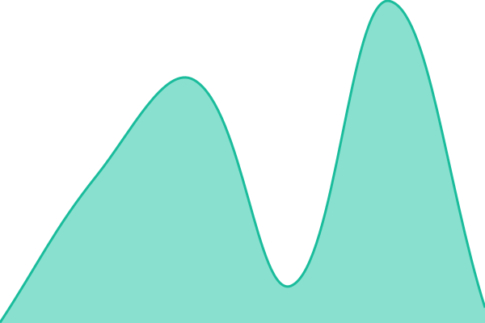
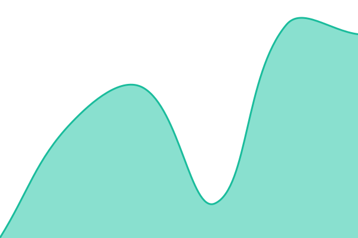
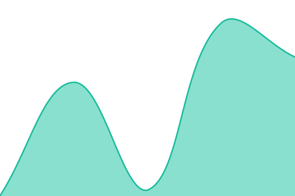
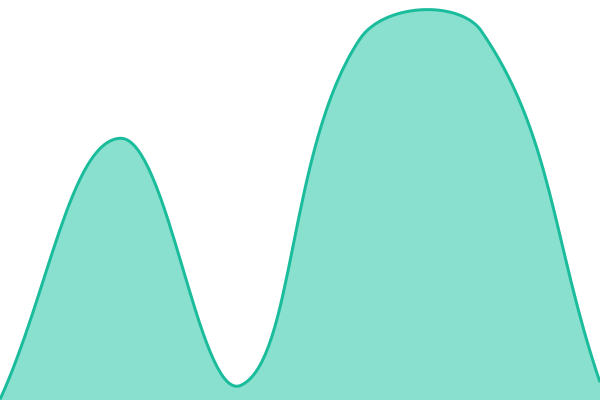
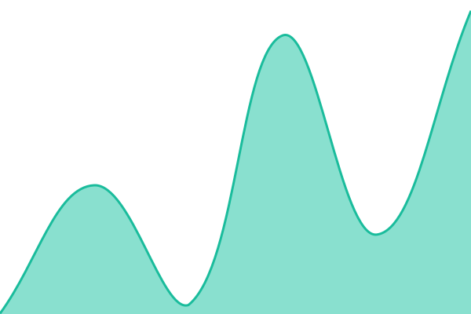

# [📈 Live Status](https://status.helix.aidigitallabs.com): <!--live status--> **🟩 All systems operational**

This repository contains the open-source uptime monitor and status page for [AIDigitalLabs-Helix](https://status.helix.aidigitallabs.com), powered by [Upptime](https://github.com/upptime/upptime).

With [Upptime](https://upptime.js.org), you can get your own unlimited and free uptime monitor and status page, powered entirely by a GitHub repository. We use [Issues](https://github.com/AIDigitalLabs-Helix/AIDigitalLabs-Helix-Status/issues) as incident reports, [Actions](https://github.com/AIDigitalLabs-Helix/AIDigitalLabs-Helix-Status/actions) as uptime monitors, and [Pages](https://status.helix.aidigitallabs.com) for the status page.

<!--start: status pages-->
<!-- This summary is generated by Upptime (https://github.com/upptime/upptime) -->
<!-- Do not edit this manually, your changes will be overwritten -->
<!-- prettier-ignore -->
| URL | Status | History | Response Time | Uptime |
| --- | ------ | ------- | ------------- | ------ |
|  [Helix API](https://api.helix.aidigitallabs.com/health) | 🟩 Up | [helix-api.yml](https://github.com/AIDigitalLabs-Helix/AIDigitalLabs-Helix-Status/commits/HEAD/history/helix-api.yml) | 

 300ms
     
 | 

<a href="https://status.helix.aidigitallabs.com/history/helix-api">100.00%</a>
    

|  [Hub](https://hub.helix.aidigitallabs.com/version.json) | 🟩 Up | [hub.yml](https://github.com/AIDigitalLabs-Helix/AIDigitalLabs-Helix-Status/commits/HEAD/history/hub.yml) | 

 517ms
     
 | 

<a href="https://status.helix.aidigitallabs.com/history/hub">100.00%</a>
    

|  [Creative Intelligence Toolkit (CIT)](https://creativeintel.helix.aidigitallabs.com/version.json) | 🟩 Up | [creative-intelligence-toolkit-cit.yml](https://github.com/AIDigitalLabs-Helix/AIDigitalLabs-Helix-Status/commits/HEAD/history/creative-intelligence-toolkit-cit.yml) | 

 345ms
     
 | 

<a href="https://status.helix.aidigitallabs.com/history/creative-intelligence-toolkit-cit">100.00%</a>
    

|  [Creative Brief Engine (CBE)](https://cbe.helix.aidigitallabs.com/version.json) | 🟩 Up | [creative-brief-engine-cbe.yml](https://github.com/AIDigitalLabs-Helix/AIDigitalLabs-Helix-Status/commits/HEAD/history/creative-brief-engine-cbe.yml) | 

 499ms
     
 | 

<a href="https://status.helix.aidigitallabs.com/history/creative-brief-engine-cbe">100.00%</a>
    

|  [Tax Yield Defence (TYD)](https://tyd.helix.aidigitallabs.com/version.json) | 🟩 Up | [tax-yield-defence-tyd.yml](https://github.com/AIDigitalLabs-Helix/AIDigitalLabs-Helix-Status/commits/HEAD/history/tax-yield-defence-tyd.yml) | 

 426ms
     
 | 

<a href="https://status.helix.aidigitallabs.com/history/tax-yield-defence-tyd">100.00%</a>
    

|  [Website Audit (WSA)](https://websiteaudit.helix.aidigitallabs.com/version.json) | 🟩 Up | [website-audit-wsa.yml](https://github.com/AIDigitalLabs-Helix/AIDigitalLabs-Helix-Status/commits/HEAD/history/website-audit-wsa.yml) | 

 308ms
     
 | 

<a href="https://status.helix.aidigitallabs.com/history/website-audit-wsa">100.00%</a>
    

|  [Synthetic Focus Group (SFG)](https://focusgroup.helix.aidigitallabs.com/version.json) | 🟩 Up | [synthetic-focus-group-sfg.yml](https://github.com/AIDigitalLabs-Helix/AIDigitalLabs-Helix-Status/commits/HEAD/history/synthetic-focus-group-sfg.yml) | 

 342ms
     
 | 

<a href="https://status.helix.aidigitallabs.com/history/synthetic-focus-group-sfg">100.00%</a>
    

|  [ModelShare (MSH)](https://modelshare.helix.aidigitallabs.com/version.json) | 🟩 Up | [model-share-msh.yml](https://github.com/AIDigitalLabs-Helix/AIDigitalLabs-Helix-Status/commits/HEAD/history/model-share-msh.yml) | 

 364ms
     
 | 

<a href="https://status.helix.aidigitallabs.com/history/model-share-msh">100.00%</a>
    

|  [Co-op Grant Programme (CGP)](https://cgp.helix.aidigitallabs.com/version.json) | 🟩 Up | [co-op-grant-programme-cgp.yml](https://github.com/AIDigitalLabs-Helix/AIDigitalLabs-Helix-Status/commits/HEAD/history/co-op-grant-programme-cgp.yml) | 

 577ms
     
 | 

<a href="https://status.helix.aidigitallabs.com/history/co-op-grant-programme-cgp">100.00%</a>
    

|  [Traveler Segment Builder (TSB)](https://tsb.helix.aidigitallabs.com/version.json) | 🟩 Up | [traveler-segment-builder-tsb.yml](https://github.com/AIDigitalLabs-Helix/AIDigitalLabs-Helix-Status/commits/HEAD/history/traveler-segment-builder-tsb.yml) | 

 276ms
     
 | 

<a href="https://status.helix.aidigitallabs.com/history/traveler-segment-builder-tsb">100.00%</a>
    

|  [Competitor Campaign Scout (CCS)](https://competitorscout.helix.aidigitallabs.com/version.json) | 🟩 Up | [competitor-campaign-scout-ccs.yml](https://github.com/AIDigitalLabs-Helix/AIDigitalLabs-Helix-Status/commits/HEAD/history/competitor-campaign-scout-ccs.yml) | 

 366ms
     
 | 

<a href="https://status.helix.aidigitallabs.com/history/competitor-campaign-scout-ccs">100.00%</a>
    

|  [Social Pulse Check (SPC)](https://socialpulse.helix.aidigitallabs.com/version.json) | 🟩 Up | [social-pulse-check-spc.yml](https://github.com/AIDigitalLabs-Helix/AIDigitalLabs-Helix-Status/commits/HEAD/history/social-pulse-check-spc.yml) | 

 393ms
     
 | 

<a href="https://status.helix.aidigitallabs.com/history/social-pulse-check-spc">100.00%</a>
    

|  [Influencer Discovery (ICD)](https://influencerdiscovery.helix.aidigitallabs.com/version.json) | 🟩 Up | [influencer-discovery-icd.yml](https://github.com/AIDigitalLabs-Helix/AIDigitalLabs-Helix-Status/commits/HEAD/history/influencer-discovery-icd.yml) | 

 496ms
     
 | 

<a href="https://status.helix.aidigitallabs.com/history/influencer-discovery-icd">100.00%</a>
    

|  [Retail Media Scanner (RMS)](https://rms.helix.aidigitallabs.com/version.json) | 🟩 Up | [retail-media-scanner-rms.yml](https://github.com/AIDigitalLabs-Helix/AIDigitalLabs-Helix-Status/commits/HEAD/history/retail-media-scanner-rms.yml) | 

 454ms
     
 | 

<a href="https://status.helix.aidigitallabs.com/history/retail-media-scanner-rms">100.00%</a>
    

|  [Dealer Lot Radar (DLR)](https://dlr.helix.aidigitallabs.com/version.json) | 🟩 Up | [dealer-lot-radar-dlr.yml](https://github.com/AIDigitalLabs-Helix/AIDigitalLabs-Helix-Status/commits/HEAD/history/dealer-lot-radar-dlr.yml) | 

 375ms
     
 | 

<a href="https://status.helix.aidigitallabs.com/history/dealer-lot-radar-dlr">100.00%</a>
    

|  [RadiusIQ (RIQ)](https://riq.helix.aidigitallabs.com/version.json) | 🟩 Up | [radius-iq-riq.yml](https://github.com/AIDigitalLabs-Helix/AIDigitalLabs-Helix-Status/commits/HEAD/history/radius-iq-riq.yml) | 

 412ms
     
 | 

<a href="https://status.helix.aidigitallabs.com/history/radius-iq-riq">100.00%</a>
    

|  [Program Page Report (PPR)](https://programpagereport.helix.aidigitallabs.com/version.json) | 🟩 Up | [program-page-report-ppr.yml](https://github.com/AIDigitalLabs-Helix/AIDigitalLabs-Helix-Status/commits/HEAD/history/program-page-report-ppr.yml) | 

 370ms
     
 | 

<a href="https://status.helix.aidigitallabs.com/history/program-page-report-ppr">100.00%</a>
    

|  [Graduate Earnings-Test Radar (ETR)](https://etr.helix.aidigitallabs.com/version.json) | 🟩 Up | [graduate-earnings-test-radar-etr.yml](https://github.com/AIDigitalLabs-Helix/AIDigitalLabs-Helix-Status/commits/HEAD/history/graduate-earnings-test-radar-etr.yml) | 

 637ms
     
 | 

<a href="https://status.helix.aidigitallabs.com/history/graduate-earnings-test-radar-etr">100.00%</a>
    

|  [Campaign Brief Builder (CBB)](https://briefbuilder.helix.aidigitallabs.com/version.json) | 🟩 Up | [campaign-brief-builder-cbb.yml](https://github.com/AIDigitalLabs-Helix/AIDigitalLabs-Helix-Status/commits/HEAD/history/campaign-brief-builder-cbb.yml) | 

 388ms
     
 | 

<a href="https://status.helix.aidigitallabs.com/history/campaign-brief-builder-cbb">100.00%</a>
    

|  [Persona Creator (PCR)](https://personacreator.helix.aidigitallabs.com/version.json) | 🟩 Up | [persona-creator-pcr.yml](https://github.com/AIDigitalLabs-Helix/AIDigitalLabs-Helix-Status/commits/HEAD/history/persona-creator-pcr.yml) | 

 434ms
     
 | 

<a href="https://status.helix.aidigitallabs.com/history/persona-creator-pcr">100.00%</a>
    

|  [Prompt Engineering (PEN)](https://promptengineer.helix.aidigitallabs.com/version.json) | 🟩 Up | [prompt-engineering-pen.yml](https://github.com/AIDigitalLabs-Helix/AIDigitalLabs-Helix-Status/commits/HEAD/history/prompt-engineering-pen.yml) | 

 374ms
     
 | 

<a href="https://status.helix.aidigitallabs.com/history/prompt-engineering-pen">100.00%</a>
    

|  [Case Study Composer (CSC)](https://csc.helix.aidigitallabs.com/version.json) | 🟩 Up | [case-study-composer-csc.yml](https://github.com/AIDigitalLabs-Helix/AIDigitalLabs-Helix-Status/commits/HEAD/history/case-study-composer-csc.yml) | 

 266ms
     
 | 

<a href="https://status.helix.aidigitallabs.com/history/case-study-composer-csc">100.00%</a>
    

|  [Logic & Reasoning Review (LRR)](https://logicreview.helix.aidigitallabs.com/version.json) | 🟩 Up | [logic-and-reasoning-review-lrr.yml](https://github.com/AIDigitalLabs-Helix/AIDigitalLabs-Helix-Status/commits/HEAD/history/logic-and-reasoning-review-lrr.yml) | 

 418ms
     
 | 

<a href="https://status.helix.aidigitallabs.com/history/logic-and-reasoning-review-lrr">100.00%</a>
    

|  [Legal & Compliance Audit (LCA)](https://legalaudit.helix.aidigitallabs.com/version.json) | 🟩 Up | [legal-and-compliance-audit-lca.yml](https://github.com/AIDigitalLabs-Helix/AIDigitalLabs-Helix-Status/commits/HEAD/history/legal-and-compliance-audit-lca.yml) | 

 386ms
     
 | 

<a href="https://status.helix.aidigitallabs.com/history/legal-and-compliance-audit-lca">100.00%</a>
    

|  [Concierge (CON)](https://concierge.helix.aidigitallabs.com/version.json) | 🟩 Up | [concierge-con.yml](https://github.com/AIDigitalLabs-Helix/AIDigitalLabs-Helix-Status/commits/HEAD/history/concierge-con.yml) | 

 464ms
     
 | 

<a href="https://status.helix.aidigitallabs.com/history/concierge-con">100.00%</a>
    

|  [Overlook (OVK)](https://overlook.helix.aidigitallabs.com/version.json) | 🟩 Up | [overlook-ovk.yml](https://github.com/AIDigitalLabs-Helix/AIDigitalLabs-Helix-Status/commits/HEAD/history/overlook-ovk.yml) | 

 438ms
     
 | 

<a href="https://status.helix.aidigitallabs.com/history/overlook-ovk">100.00%</a>
    

|  [Lodestar (LDS)](https://lodestar.helix.aidigitallabs.com/version.json) | 🟩 Up | [lodestar-lds.yml](https://github.com/AIDigitalLabs-Helix/AIDigitalLabs-Helix-Status/commits/HEAD/history/lodestar-lds.yml) | 

 458ms
     
 | 

<a href="https://status.helix.aidigitallabs.com/history/lodestar-lds">100.00%</a>
    

|  [Marquee (MRQ)](https://marquee.helix.aidigitallabs.com/version.json) | 🟩 Up | [marquee-mrq.yml](https://github.com/AIDigitalLabs-Helix/AIDigitalLabs-Helix-Status/commits/HEAD/history/marquee-mrq.yml) | 

 367ms
     
 | 

<a href="https://status.helix.aidigitallabs.com/history/marquee-mrq">100.00%</a>
    

|  [Quorum Trials (QTR)](https://quorumtrials.helix.aidigitallabs.com/version.json) | 🟩 Up | [quorum-trials-qtr.yml](https://github.com/AIDigitalLabs-Helix/AIDigitalLabs-Helix-Status/commits/HEAD/history/quorum-trials-qtr.yml) | 

 371ms
     
 | 

<a href="https://status.helix.aidigitallabs.com/history/quorum-trials-qtr">100.00%</a>
    

|  [Report Generator (RGN)](https://reportgenerator.helix.aidigitallabs.com/version.json) | 🟩 Up | [report-generator-rgn.yml](https://github.com/AIDigitalLabs-Helix/AIDigitalLabs-Helix-Status/commits/HEAD/history/report-generator-rgn.yml) | 

 456ms
     
 | 

<a href="https://status.helix.aidigitallabs.com/history/report-generator-rgn">100.00%</a>
    

|  [Listing Readiness (PLR)](https://plr.helix.aidigitallabs.com/version.json) | 🟩 Up | [listing-readiness-plr.yml](https://github.com/AIDigitalLabs-Helix/AIDigitalLabs-Helix-Status/commits/HEAD/history/listing-readiness-plr.yml) | 

 277ms
     
 | 

<a href="https://status.helix.aidigitallabs.com/history/listing-readiness-plr">100.00%</a>
    

|  [Groundcover (GRC)](https://grc.helix.aidigitallabs.com/version.json) | 🟩 Up | [groundcover-grc.yml](https://github.com/AIDigitalLabs-Helix/AIDigitalLabs-Helix-Status/commits/HEAD/history/groundcover-grc.yml) | 

 287ms
     
 | 

<a href="https://status.helix.aidigitallabs.com/history/groundcover-grc">100.00%</a>
    

|  [Fencerow (FCR)](https://fcr.helix.aidigitallabs.com/version.json) | 🟩 Up | [fencerow-fcr.yml](https://github.com/AIDigitalLabs-Helix/AIDigitalLabs-Helix-Status/commits/HEAD/history/fencerow-fcr.yml) | 

 344ms
     
 | 

<a href="https://status.helix.aidigitallabs.com/history/fencerow-fcr">100.00%</a>
    

|  [Winnow (WNW)](https://wnw.helix.aidigitallabs.com/version.json) | 🟩 Up | [winnow-wnw.yml](https://github.com/AIDigitalLabs-Helix/AIDigitalLabs-Helix-Status/commits/HEAD/history/winnow-wnw.yml) | 

 489ms
     
 | 

<a href="https://status.helix.aidigitallabs.com/history/winnow-wnw">100.00%</a>
    

|  [Co-Op Radar IQ (CRI)](https://cri.helix.aidigitallabs.com/version.json) | 🟩 Up | [co-op-radar-iq-cri.yml](https://github.com/AIDigitalLabs-Helix/AIDigitalLabs-Helix-Status/commits/HEAD/history/co-op-radar-iq-cri.yml) | 

 411ms
     
 | 

<a href="https://status.helix.aidigitallabs.com/history/co-op-radar-iq-cri">100.00%</a>
    

<!--end: status pages-->

[**Visit our status website →**](https://status.helix.aidigitallabs.com)

## 📄 License

- Powered by: [Upptime](https://github.com/upptime/upptime)
- Code: [MIT](./LICENSE) © [Anand Chowdhary](https://anandchowdhary.com)
- Data in the `./history` directory: [Open Database License](https://opendatacommons.org/licenses/odbl/1-0/)
